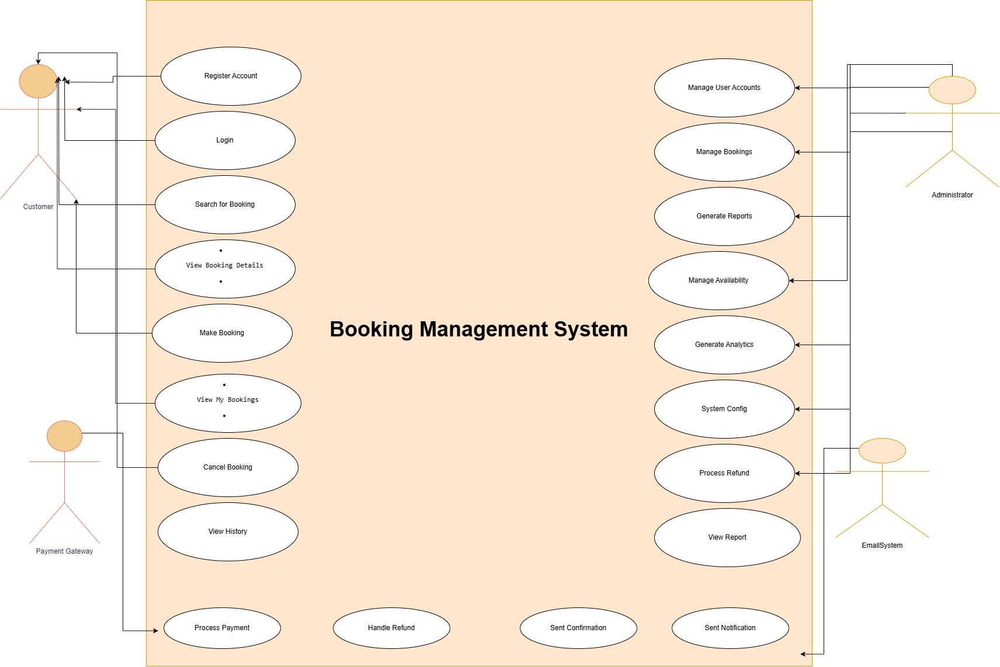

# Requirement Analysis in Software Development

This repository covers the fundamentals and key concepts of Requirement Analysis in software development. It serves as a guide to understanding the process, importance, activities, and types of requirements involved in the software development lifecycle (SDLC). Additionally, it includes a practical example related to a booking management system.

## What is Requirement Analysis?

Requirement Analysis is the process of identifying, gathering, and understanding the needs and expectations of users and stakeholders for a software application. It involves detailed examination and documentation of these needs to ensure that the final software product aligns with what the users require.

In the Software Development Lifecycle (SDLC), Requirement Analysis is a critical phase that lays the foundation for design, development, and testing. Proper requirement analysis helps prevent misunderstandings, reduces project risks, and ensures that the software meets business goals.

## Why is Requirement Analysis Important?

Requirement Analysis is a crucial step in software development because it lays the foundation for everything that follows. Here are some key reasons why it's important:

- **Clarity and Focus:** It ensures that everyone involved, from developers to stakeholders, understands what the software should do, reducing confusion and miscommunication.

- **Cost and Time Efficiency:** By identifying and resolving misunderstandings early in the process, requirement analysis helps avoid costly changes and rework later in the project lifecycle.

- **Meeting User Needs:** It ensures the software product is aligned with what the users actually want and need, leading to higher user satisfaction and better adoption.

- **Improved Planning:** Well-defined requirements make it easier to estimate time, resources, and potential risks, allowing for better project planning and execution.

## Key Activities in Requirement Analysis

Requirement Analysis involves several important activities that help in understanding and documenting what the software should achieve. Below are the five key activities:

- **Requirement Gathering:** Collecting relevant information from stakeholders, users, and subject matter experts to understand what is needed.

- **Requirement Elicitation:** Using techniques like interviews, surveys, workshops, and brainstorming sessions to uncover deeper needs and expectations.

- **Requirement Documentation:** Clearly recording the gathered requirements in a structured and understandable format for everyone involved.

- **Requirement Analysis and Modeling:** Studying the collected information to identify conflicts, gaps, and dependencies, and representing them using models or diagrams.

- **Requirement Validation:** Ensuring that the documented requirements are correct, complete, and agreed upon by all stakeholders before development begins.

## Types of Requirements

In software development, requirements are generally divided into two main types: **Functional** and **Non-functional**. Both are essential for delivering a complete and successful system.

### Functional Requirements

Functional requirements describe **what the system should do**. They focus on specific behaviors, functions, or features that the software must perform.

**Examples for the Booking Management System:**
- The system shall allow users to create, view, and cancel bookings.
- Users shall be able to log in and manage their booking history.
- The admin shall be able to approve or reject user bookings.
- The system shall send confirmation emails after successful bookings.

### Non-functional Requirements

Non-functional requirements describe **how the system should perform**. They focus on quality attributes such as performance, usability, security, and reliability.

**Examples for the Booking Management System:**
- The system shall load booking pages within 2 seconds.
- The platform must be available 99.9% of the time (high availability).
- All user data shall be encrypted during transmission and storage.
- The system interface shall be responsive across desktops and mobile devices.

## Use Case Diagrams

A **Use Case Diagram** is a visual representation that shows how users (actors) interact with a system through various functionalities (use cases). It helps stakeholders understand the system's functionality from the user’s perspective.

### Benefits of Use Case Diagrams:
- Improves communication between technical and non-technical team members.
- Clearly defines system boundaries and user interactions.
- Helps identify system requirements early in the development cycle.

### Use Case Diagram for Booking Management System

**Actors:**
- User
- Admin

**Use Cases:**
- Book Ticket
- Cancel Booking
- View Booking History
- Manage Bookings (Admin)

**Diagram:**

## Acceptance Criteria

**Acceptance Criteria** are predefined conditions or requirements that a software feature must satisfy to be accepted by the end user or client.

They serve as a checklist to determine whether a feature works as intended and meets business goals. These criteria are defined before development begins and are used during testing to validate functionality.

### Why Acceptance Criteria Matter:
- Define what "done" means for a feature
- Ensure the feature meets user expectations
- Help developers and testers stay aligned
- Reduce ambiguity and scope creep

### Example: Checkout Feature in Booking Management System

**Acceptance Criteria:**
- The user can view a summary of their booking before checkout.
- The system processes valid payment methods (e.g., card, PayPal) securely.
- An error message is displayed if payment fails.
- A confirmation message and email are sent after successful checkout.
- The booking details are saved and updated in the user's history.

